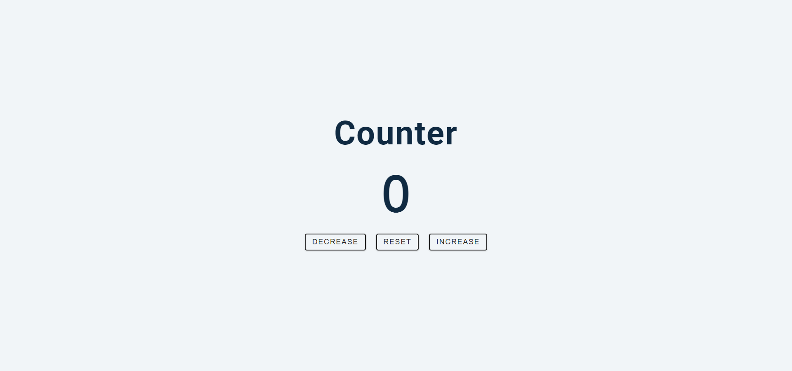

# JS - Counter Project

**Key concepts covered:**

- document.querySelectorAll()
- forEach()
- addEventListener()
- currentTarget property
- classList
- textContent

#### Main Task

- - - 

[Project Live link](https://cpazad.github.io/counter/)
- - -
*Md. Azadur Rahman* 
[Fiverr Link](https://www.fiverr.com/cpazad) 
[Twitter Link](https://twitter.com/freedombyte)